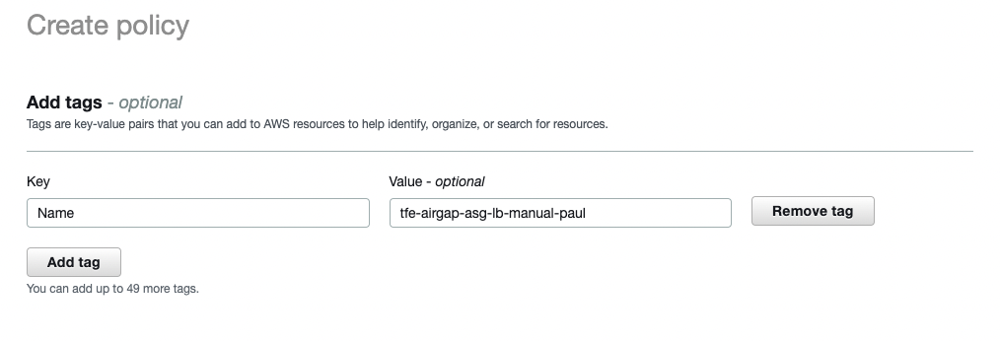
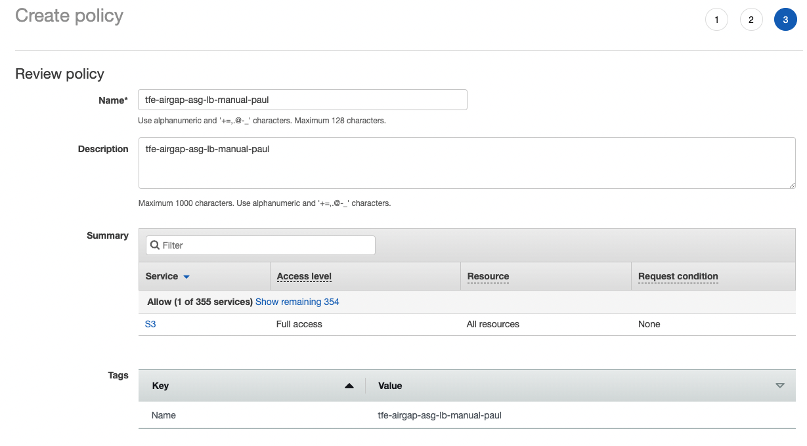
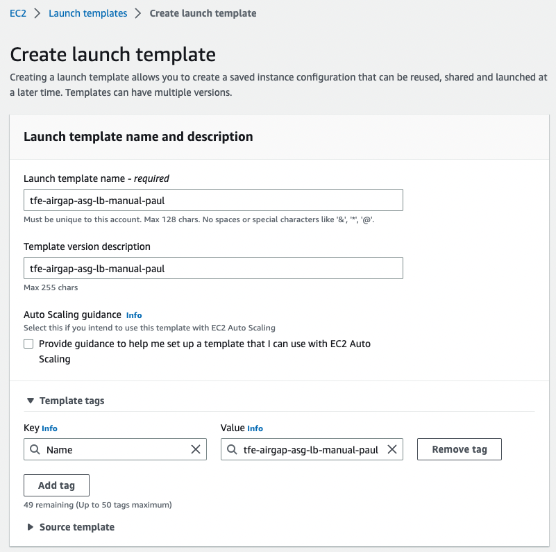

# Manual installation of TFE (Airgapped), external services, valid certificate, autoscaling group and loadbalancer on AWS

Here it is described how to manually install Airgapped Terraform Enterpise (TFE) with external services (PostgreSQL and S3), valid certificate, autoscaling group and loadbalancer on AWS.  

Official installation documentation can be found [here](https://www.terraform.io/enterprise/install/interactive/installer).  

# Prerequisites
- AWS account
- Airgapped installation file
- TFE license

# How to
tfe-airgap-asg-lb-manual-paul

## VPC
Go to `VPC` and click `Create VPC`.  
     
Give it a name and an IPv4 CIDR range. 

## Subnets
Go to `Subnets`.  

### Public1
Click on `Create subnet`.  
    
Select your VPC.  

      
Supply a name and an IPv4 CIDR block within the range of the VPC CIDR.  

Click `Create subnet`.  

### Public2
Click on `Create subnet`.  
    
Select your VPC.  

       
Supply a name and an IPv4 CIDR block within the range of the VPC CIDR.  
Select a different Availability Zone from subnet public1.  

Click `Create subnet`.  

### Private1
Click on `Create subnet`.  
    
Select your VPC.  

        
Supply a name and an IPv4 CIDR block within the range of the VPC CIDR.  

Click `Create subnet`. 

### Private2
Click on `Create subnet`.  
    
Select your VPC.  

         
Supply a name and an IPv4 CIDR block within the range of the VPC CIDR.  
Select a different Availability Zone from subnet public1.  

Click `Create subnet`.   

## Internet Gateway
Go to `Internet gateways`.  
Click `Create Internet gateway`.  
    
Provide a name and click `Create internet gateway`.  

Click on `Actions` and then on `Attach to VPC`.  
    
Select the VPC and click on `Attach internet gateway`.  

## NAT gateway
Goto `NAT gateways` and click `Create NAT gateway`.  
  
Provide a name.  
Select private subnet 1.  
Click `Allocate Elastic IP`.  
Click `Create NAT gateway`.  

## Route table
### Public
Go to `Route tables` and select the new route table.  
   

Click on `Edit routes`.  
   
Add a route with destination `0.0.0.0/0` and target the created internet gateway.  
Click `Save changes`.  

Go to `Subnet associations`.  
Click `Edit subnet associations`.  
  
Select the 2 public subnets.  
Click `Save associations`.  

### Private
Go to `Route tables` and click `Create route table`.  
  
Provide a name.  
Select the VPC.  
Click `Create route table`.  

Click on `Edit routes`.  
  
Add a route with destination `0.0.0.0/0` and target the created NAT gateway.  
Click `Save changes`.  

Go to `Subnet associations`.  
Click `Edit subnet associations`.  
    
Select the 2 private subnets.  
Click `Save associations`.  

## Key pair
To be able to login with ssh to your ec2 instance, you'll need a key pair.  
Go to `Key pairs` and click `Create key pair`.  
      

Give it a useful name and click `Create key pair`.  

A pem file will be downloaded in the browser.  
Store this pem file in a secure location and change the permissions to only your user.  
On linux/mac:
```
chmod 0600 tfe_valid_cert_paul.pem
```

## Security group
Allow certain ports to connect to your TFE instance.  
Go to Security Groups and click Create security groups.  
    
Supply a name, description and select the VPC.  

   
Port 22, 443 and 8800 are accessible from anywhere.  
Port 5432 is accessible from anywhere within the VPC.  

Click `Create security group`.  

## S3 Buckets
Bucket for TFE state
Go to `Buckets`.  
Click `Create bucket`.  

  
Provide a name and select the region.  

  
  

Bucket for files
Create another bucket the same way.  Suffix with `-files`.  
This will be used to upload files.  

# Files to S3 bucket
Upload these files to the S3 bucket
- license.rli
- airgap file
- private key as tfe_server.key
- server cert as tfe_server.crt

## Policy for access to buckets
Go to Identity and Access Management (IAM) and then `Policies`.
Click `Create policy`.
Go to the `JSON` tab and provide  
```
{
    "Version": "2012-10-17",
    "Statement": [
        {
            "Sid": "VisualEditor0",
            "Effect": "Allow",
            "Action": [
                "s3:ListStorageLensConfigurations",
                "s3:ListAccessPointsForObjectLambda",
                "s3:GetAccessPoint",
                "s3:PutAccountPublicAccessBlock",
                "s3:GetAccountPublicAccessBlock",
                "s3:ListAllMyBuckets",
                "s3:ListAccessPoints",
                "s3:PutAccessPointPublicAccessBlock",
                "s3:ListJobs",
                "s3:PutStorageLensConfiguration",
                "s3:ListMultiRegionAccessPoints",
                "s3:CreateJob"
            ],
            "Resource": "*"
        },
        {
            "Sid": "VisualEditor1",
            "Effect": "Allow",
            "Action": "s3:*",
            "Resource": "*"
        }
    ]
}
```
  
Click `Next: Tags`.  

  
Click `Next: Review`.

  
Provide a name.  
Click `Create policy`.  

## Role for EC2 instances
Go to Identity and Access Management (IAM) and then `Roles`.  
Click `Create role`.  

  
Select `AWS service`.  
Select `EC2` under common use cases.  
Click `Next`.  

  
Find the policy and select.  
Click `Next`.  

  
Provide a name.  

  
Add a tag if wanted.  
Click `Create role`.  

## DB subnet group
In `RDS` go to `Subnet groups` and click `Create DB subnet groups`.  

  
Provide a name.  
Select the VPC.  

  
Select the two private subnets.  

Click `Create`.  

## PostgreSQL
Go to `RDS`.  
Click `Create database`.  

  
Select `Standard create`.  

  
Select `PostgreSQL`.  
Select engine version `PostgreSQL 14.5-R1`.  

  
Select `Dev/Test`.  

  
Select `Single DB instance`.  

   
Provide an instance name.  
Provide a master password.  

  
Select the instance size. `db.m5.large`.  

  
Select the storage type.  
Set allocated storage to 50GB.  

  
Select the VPC.  
Select the `DB subnet group`.  

  
Select the security group.  
Remove the default security group.  

  

  
Provide an `Initial database name`.  

Click `Create database`.  

## Target Groups
Go to `Target Groups` and click `Create target group`.  

    
Select `Instances` and provide a name.  
  
Select protocol `HTTPS` and provide port number `8800`.  
Select the VPC.  
  
Expand `Advanced health check settings`.  
Under `Success codes` add `,301,302`.
Click `Next`.  

No targets needed, so click `Create target group`.  

Do the same for HTTPS port 443.  

## Load balancer
Go to `Load Balancers` and click `Create Load Balancer`.  

  
Click `Create` on the `Application Load Balancer`.  

  
Provide a name.  

  
Select the VPC and select the public subnets.  

   
Select the security group.  
Remove the default security group.  

  
Select a target group, we will remove this listener later.   

Click `Create load balancer`.  

## DNS
Go to Route 53, Hosted Zones, tf-support.hashicorpdemo.com
Click `Create record`.

  
Enter a `Record name`, this will be the subdomain of the hosted zone.  
Select `Alias`.  
Enable `Alias to Application and Classic Load Balancer`.  
Select your region.  
Select the load balancer.  
Disable `Evaluate target health`.  
Click `Create records`.  

## Certificate from Let's Encrypt
On a UNIX machine with certbot installed enter the following command:
```
sudo certbot -d tfe-airgap-asg-lb-manual-paul.tf-support.hashicorpdemo.com --manual --preferred-challenges dns certonly --register-unsafely-without-email
```

Create a DNS record as described
  
Click `Create records`.

Click on `View status` and make sure it is `insync`.

Hit Enter on the commandline.

```
Successfully received certificate.
Certificate is saved at: /etc/letsencrypt/live/tfe-airgap-asg-lb-manual-paul.tf-support.hashicorpdemo.com/fullchain.pem
Key is saved at:         /etc/letsencrypt/live/tfe-airgap-asg-lb-manual-paul.tf-support.hashicorpdemo.com/privkey.pem
This certificate expires on 2023-03-07.
...
```
Delete the created DNS TXT record.

From the stored Let's Encrypt files, retrieve the fullchain.pem and privkey.pem.

```
sudo cp /etc/letsencrypt/live/tfe-airgap-asg-lb-manual-paul.tf-support.hashicorpdemo.com/fullchain.pem ./
sudo cp /etc/letsencrypt/live/tfe-airgap-asg-lb-manual-paul.tf-support.hashicorpdemo.com/privkey.pem ./
sudo chown paulboekschoten:staff fullchain.pem privkey.pem
```

## Listeners
Go to `Load Balancers` and select your loadbalancer
   
Select the listener for port 80 and delete.  
Click `Add listener`.  

   
Select protocol `HTTPS`.  
Add port number `8800`.  
Under `Default actions` select `Forward`.  
Select the target group.  

  
Instead `From ACM` select `Import`.  
Paste the certificate details to the corresponding boxes.  

Click `Add`.  

Repeat these steps for port 443.  

## Launch templates
Launch configuration will soon be deprecated. Use `launch templates` instead.  

Go to `Launch Templates` and click `Create launch template`.  

   
Provide a name and a description.  

  
Find the AMI of your choice and select.  

  
Select `m5.xlarge`.  

  
Select the key pair.  

  
Select subnet private1.  
Select the security group.  

  
Set the storage volume to 50GB.  

  
If wanted, provide a tag. This will be added to the instances that are run with this launch template.  

Expand `Advanced details`.  
  
Select the IAM instance profile.  

Under `User data` enter the following:  
(check that all values are correct for your environment)   
```
#cloud-config
packages:
- git 
- jq 
- vim 
- language-pack-en
- wget
- curl
- zip
- unzip
- ca-certificates
- gnupg
- lsb-release
write_files:
  - path: "/etc/replicated.conf"
    permissions: "0755"
    owner: "root:root"
    content: |
      {
        "DaemonAuthenticationType":     "password",
        "DaemonAuthenticationPassword": "Password#1",
        "TlsBootstrapType":             "server-path",
        "TlsBootstrapHostname":         "tfe-airgap-asg-lb-manual-paul.tf-support.hashicorpdemo.com",
        "TlsBootstrapCert":             "/tmp/tfe_server.crt",
        "TlsBootstrapKey":              "/tmp/tfe_server.key",
        "BypassPreflightChecks":        true,
        "ImportSettingsFrom":           "/etc/settings.json",
        "LicenseFileLocation":          "/tmp/license.rli",
        "LicenseBootstrapAirgapPackagePath": "/tmp/tfe_660.airgap"
      }
  - path: "/etc/settings.json"
    permissions: "0755"
    owner: "root:root"
    content: |
      {
        "hostname": {
            "value": "tfe-airgap-asg-lb-manual-paul.tf-support.hashicorpdemo.com"
        },
        "enc_password": {
            "value": "Password#1"
        },
        "aws_instance_profile": {
           "value": "1"
        },
        "s3_bucket": {
            "value": "tfe-airgap-asg-lb-manual-paul"
        },
        "s3_region": {
            "value": "eu-west-3"
        },
        "pg_dbname": {
            "value": "tfe"
        },
        "pg_extra_params": {
            "value": "sslmode=require"
        },
        "pg_netloc": {
            "value": "tfe-airgap-asg-lb-manual-paul.c3zibg8wqccx.eu-west-3.rds.amazonaws.com"
        },
        "pg_password": {
            "value": "Password#1"
        },
        "pg_user": {
            "value": "postgres"
        },
        "placement": {
            "value": "placement_s3"
        },
        "production_type": {
            "value": "external"
        }
      }
  - path: "/etc/tfe_initial_user.json"
    permissions: "0755"
    owner: "root:root"
    content: |
      {
        "username": "tfe_admin",
        "email": "paul.boekschoten@hashicorp.com",
        "password": "Password#1"
      }
  - path: "/tmp/install-tfe.sh"
    permissions: "0755"
    owner: "root:root"
    content: |
      #!/bin/bash -eux
      private_ip=$(curl http://169.254.169.254/latest/meta-data/local-ipv4)

      mkdir -p /tmp/replicated_installer
      curl -sL https://install.terraform.io/airgap/latest.tar.gz > /tmp/replicated_installer.tar.gz
      tar xzf /tmp/replicated_installer.tar.gz -C /tmp/replicated_installer
      cd /tmp/replicated_installer
      bash ./install.sh airgap private-address=$private_ip

      while ! curl -kLsfS --connect-timeout 5 https://tfe-airgap-asg-lb-manual-paul.tf-support.hashicorpdemo.com/_health_check &>/dev/null ; do
        echo "INFO: TFE has not been yet fully started"
        echo "INFO: sleeping 60 seconds"
        sleep 60
      done

      echo "INFO: TFE is up and running"

      if [ ! -f /etc/iact.txt ]; then
        initial_token=$(replicated admin --tty=0 retrieve-iact | tr -d '\r')
        echo $initial_token > /etc/iact.txt
      fi

      curl -k \
        --header "Content-Type: application/json" \
        --request POST \
        --data @/etc/tfe_initial_user.json \
        https://tfe-airgap-asg-lb-manual-paul.tf-support.hashicorpdemo.com/admin/initial-admin-user?token=$initial_token | tee /etc/tfe_initial_user_token.json
runcmd: 
  - sudo mkdir -p /etc/apt/keyrings 
  - curl -fsSL https://download.docker.com/linux/ubuntu/gpg | sudo gpg --dearmor -o /etc/apt/keyrings/docker.gpg
  - echo "deb [arch=$(dpkg --print-architecture) signed-by=/etc/apt/keyrings/docker.gpg] https://download.docker.com/linux/ubuntu $(lsb_release -cs) stable" | sudo tee /etc/apt/sources.list.d/docker.list > /dev/null
  - sudo apt-get -y update
  - sudo apt-get -y install docker-ce docker-ce-cli containerd.io docker-compose-plugin
  - curl "https://awscli.amazonaws.com/awscli-exe-linux-x86_64.zip" -o "/tmp/awscliv2.zip"
  - unzip /tmp/awscliv2.zip -d /tmp/
  - sudo /tmp/aws/install
  - aws s3 cp s3://tfe-airgap-asg-lb-manual-paul-files/tfe_660.airgap /tmp/
  - aws s3 cp s3://tfe-airgap-asg-lb-manual-paul-files/license.rli /tmp/
  - aws s3 cp s3://tfe-airgap-asg-lb-manual-paul-files/tfe_server.crt /tmp/
  - aws s3 cp s3://tfe-airgap-asg-lb-manual-paul-files/tfe_server.key /tmp/
  - bash /tmp/install-tfe.sh
```

Click `Create launch template`.  

TODO, advanced details for IAM and user_data.  

## Auto scaling group
Goto `Auto Scaling Groups` and click `Create Auto Scaling group`.  

   
Provide a name.  
Select your `Launch Template`.  
Click `Next`.  

    
Select the VPC.  
Select private subnet 1.  
Click `Next`.  


Select `Attach to an existing loadbalancer`.  
Select the two target groups.  
Click `Next`.  

  
For now leave the capacity on 1, will adjust this later.  
Click `Next`.  

  
Click `Next`.  

  
Provide a tag, this will be propagated to new instances as well, if checkbox `Tag new instances` is selected.  
Click `Next`.  

On the `Review` page, click `Create Auto Scaling group`.  

